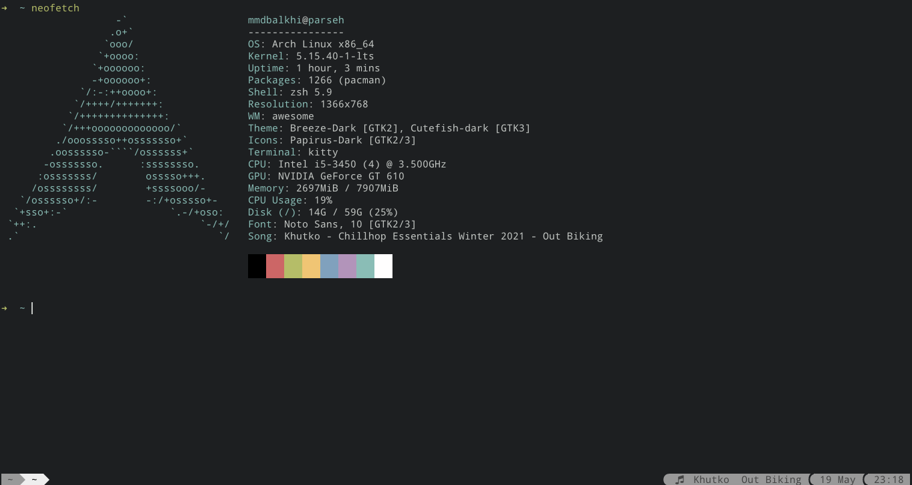
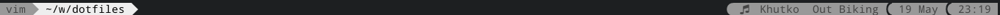

# kitty terminal emulator dotfiles

how to use this dotfile:

```sh
cd dotfiles
cp -rv .config/kitty ~/.config/kitty
```

* screenshot



* bar menu



other tab bar menu configs [on here](https://github.com/kovidgoyal/kitty/discussions/4447)
